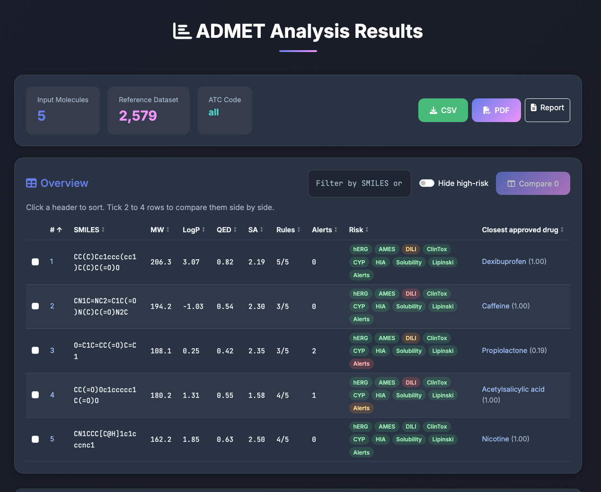
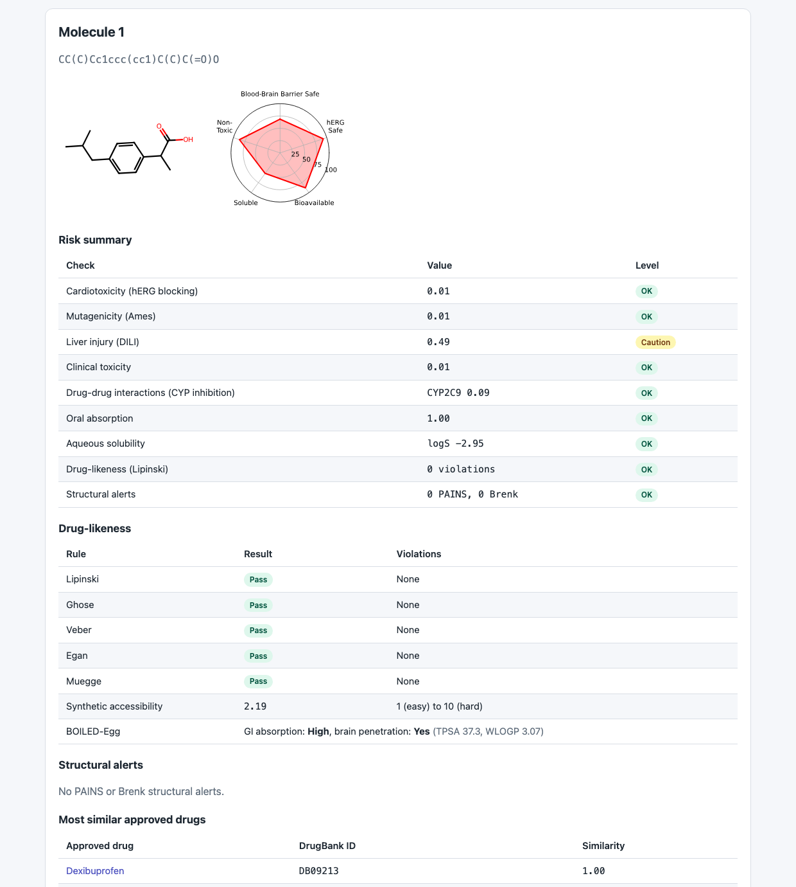
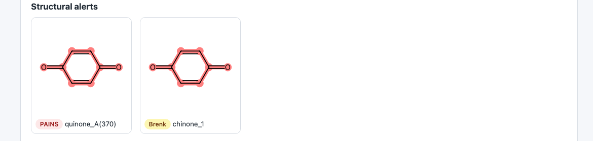
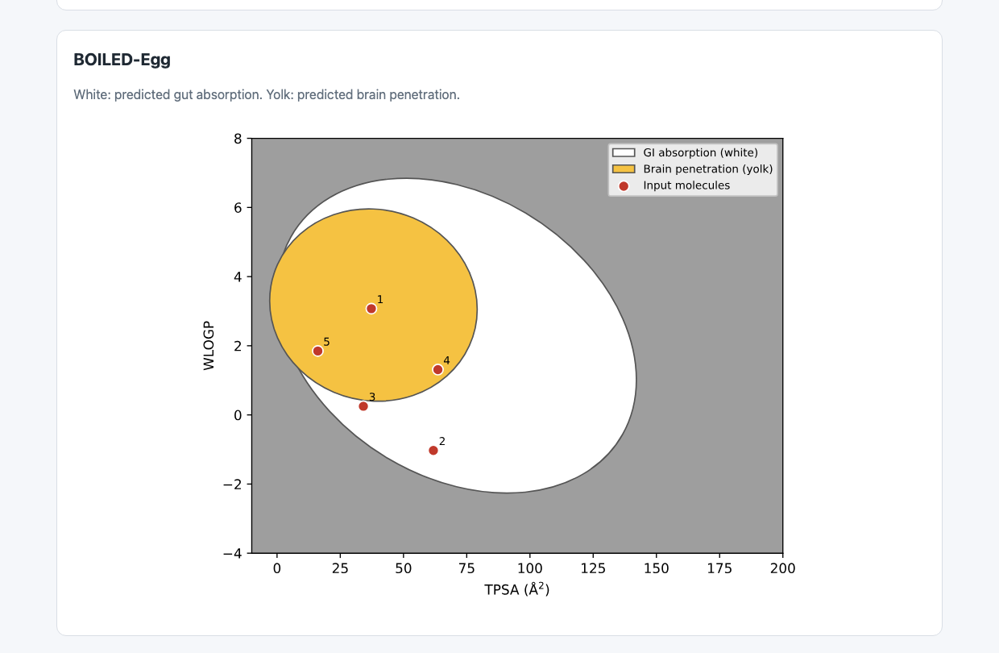
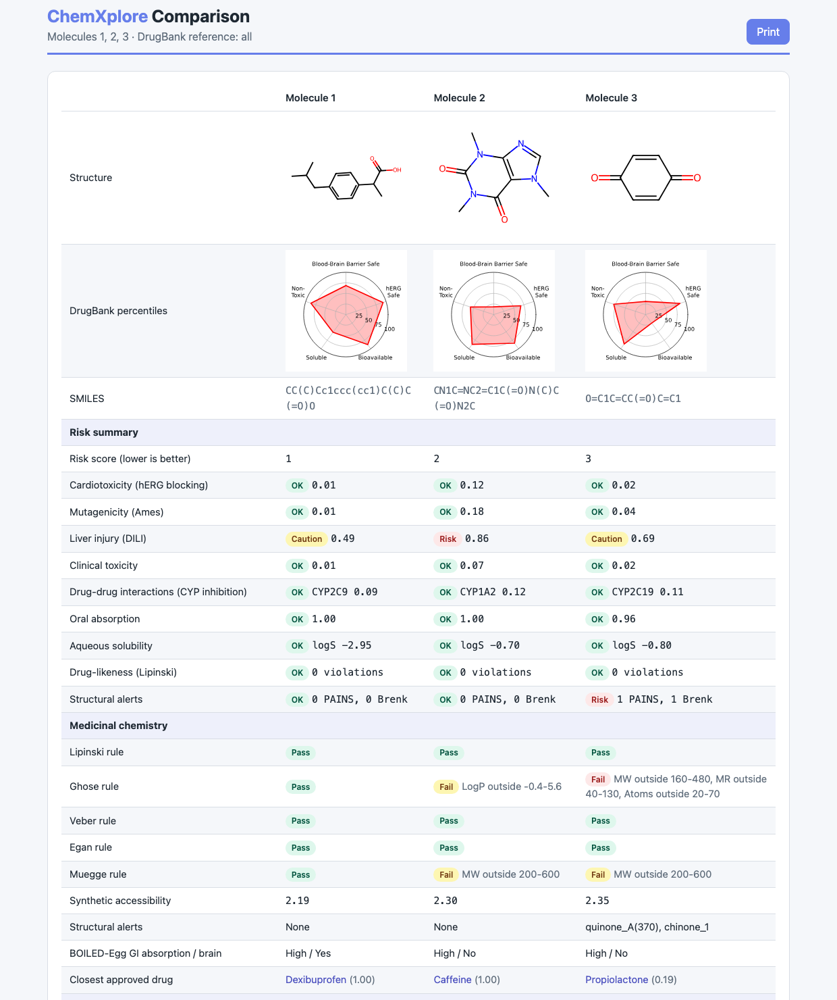
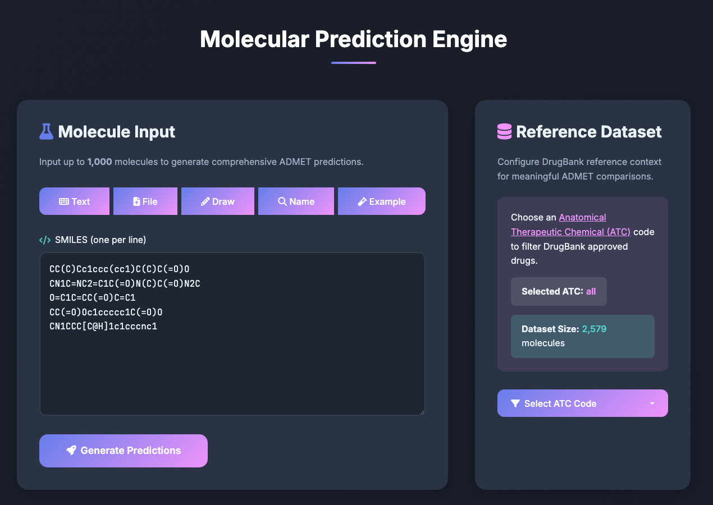

# ChemXplore

[](https://github.com/12keerti21/ChemXplore/actions/workflows/tests.yml)
[](LICENSE)

ChemXplore predicts the ADMET properties (absorption, distribution, metabolism, excretion and toxicity) of small
molecules and adds the medicinal chemistry checks needed to triage them. It is built on
[ADMET-AI](https://github.com/swansonk14/admet_ai), which uses [Chemprop-RDKit](https://github.com/chemprop/chemprop)
models trained on 41 ADMET datasets from the [Therapeutics Data Commons](https://tdcommons.ai/).

It runs as a web app, a command line tool, a Python module or a JSON API.



## Features

- **41 ADMET predictions and 8 physicochemical properties**, each with its percentile against approved DrugBank drugs.
  The reference set can be narrowed to an ATC class such as `analgesics`.
- **Drug-likeness rules:** Lipinski, Ghose, Veber, Egan and Muegge, listing the criteria each molecule breaks.
- **Structural alerts:** PAINS and Brenk substructures, with the matching atoms highlighted on the structure.
- **Synthetic accessibility score** (Ertl & Schuffenhauer), 1 (easy) to 10 (hard).
- **BOILED-Egg** prediction and plot of gut absorption and brain penetration (Daina & Zoete, 2016).
- **Closest approved drugs** by Morgan fingerprint similarity, linked to DrugBank.
- **Risk summary:** a red/amber/green rating per molecule across cardiotoxicity, mutagenicity, liver injury, clinical
  toxicity, CYP inhibition, absorption, solubility, drug-likeness and structural alerts.
- **Web app:** SMILES, CSV, drawn structure or compound name (via PubChem) as input; a sortable, filterable overview
  table; side-by-side comparison of up to 4 molecules; CSV download and a printable PDF report.

> The risk thresholds are screening heuristics for prioritising molecules, not clinical judgements.
> Predictions are for research use only.

## A look around

**Every molecule gets a full breakdown** — risk summary, drug-likeness rules, structural alerts and the approved drugs
it most resembles:



**Structural alerts highlight the offending atoms**, so you can see exactly which part of the molecule triggered them:



**The BOILED-Egg plot** shows at a glance which molecules should be absorbed from the gut (white) and which should
reach the brain (yolk):



**Compare up to 4 molecules side by side**, down to every individual property:



## Table of contents

- [Features](#features)
- [A look around](#a-look-around)
- [Installation](#installation)
- [Web app](#web-app)
- [Command line](#command-line)
- [Python module](#python-module)
- [JSON API](#json-api)
- [Docker](#docker)
- [Development](#development)
- [Citation](#citation)

## Installation

ChemXplore needs Python 3.10 or newer.

```bash
git clone https://github.com/12keerti21/ChemXplore.git
cd ChemXplore
python -m venv .venv
source .venv/bin/activate
pip install -e ".[web]"
```

chemprop 1.6.1 cannot load its model files with PyTorch 2.6 or newer, so `torch<2.6` is pinned. On a machine without a
GPU, installing the smaller CPU build of PyTorch first keeps the download down:

```bash
pip install "torch==2.5.1" --index-url https://download.pytorch.org/whl/cpu
```

If you hit `ImportError: libXrender.so.1`, run `conda install -c conda-forge xorg-libxrender`.

## Web app

```bash
admet_web --port 5000
```

Then open http://127.0.0.1:5000.

Paste SMILES, upload a CSV, draw a structure or type compound names:



Set the `CHEMXPLORE_SECRET_KEY` environment variable to keep sessions working across restarts; without it a random key
is generated at startup and everyone is logged out when the server restarts.

Predictions are held in memory per process and dropped after five minutes of inactivity, so run a single worker with
several threads rather than multiple workers.

### PDF reports

The **PDF** button produces a PDF directly when [wkhtmltopdf](https://wkhtmltopdf.org/) is installed (the Docker image
includes it). Without it, the button opens the printable report instead, which you can save as a PDF from the browser's
print dialog.

## Command line

```bash
admet_predict \
    --data_path data.csv \
    --save_path preds.csv \
    --smiles_column smiles \
    --include_medchem
```

This reads SMILES from the `smiles` column of `data.csv` and writes predictions to `preds.csv`. Adding
`--include_medchem` appends the drug-likeness, structural alert, synthetic accessibility and BOILED-Egg columns.

## Python module

```python
from admet_ai import ADMETModel

model = ADMETModel()
preds = model.predict(smiles="O(c1ccc(cc1)CCOC)CC(O)CNC(C)C")
```

Passing a single SMILES returns a dictionary of property names to values; passing a list returns a DataFrame indexed by
SMILES. The medicinal chemistry checks are separate:

```python
from rdkit import Chem
from admet_ai.medchem import analyze_molecule
from admet_ai.similarity import find_similar_drugs

mol = Chem.MolFromSmiles("CC(C)Cc1ccc(cc1)C(C)C(=O)O")
analysis = analyze_molecule(mol)       # rules, alerts, sa_score, boiled_egg
drugs = find_similar_drugs(mol, top_k=5)
```

## JSON API

```bash
curl -X POST http://127.0.0.1:5000/api/predict \
    -H 'Content-Type: application/json' \
    -d '{"smiles": ["CC(C)Cc1ccc(cc1)C(C)C(=O)O"], "similar_drugs": 3}'
```

The body takes `smiles` (a list, required), `atc_code` (an ATC class name or `all`) and `similar_drugs` (0 to 20). The
response holds one entry per valid molecule with its `predictions`, `drugbank_percentiles`, `medchem`, `risk` and
`similar_drugs`, plus any `invalid_smiles`. `GET /api/health` reports the running version.

## Docker

```bash
docker build -t chemxplore .
docker run -p 5000:5000 -e CHEMXPLORE_SECRET_KEY=change-me chemxplore
```

The image includes `wkhtmltopdf`, so PDF reports work without extra setup.

## Development

```bash
pip install -e ".[web,dev]"
pytest
```

The tests load the real models and cover the chemistry modules, the risk rules and every web route.

### Analysis plots

The DrugBank reference and radial plots can also be generated locally with `scripts/plot_drugbank_reference.py` and
`scripts/plot_radial_summaries.py`. Both take a CSV of predictions as input.

## Citation

ChemXplore builds on ADMET-AI. Please cite the original paper if this is useful in your work, and see
[docs/reproduce.md](docs/reproduce.md) to reproduce its results.

[ADMET-AI: A machine learning ADMET platform for evaluation of large-scale chemical libraries](https://academic.oup.com/bioinformatics/advance-article/doi/10.1093/bioinformatics/btae416/7698030)

Other methods used here:

- Daina, A. & Zoete, V. *A BOILED-Egg to predict gastrointestinal absorption and brain penetration of small molecules.*
  ChemMedChem 11, 1117–1121 (2016).
- Ertl, P. & Schuffenhauer, A. *Estimation of synthetic accessibility score of drug-like molecules.* J. Cheminform. 1, 8
  (2009).
- Baell, J. B. & Holloway, G. A. *New substructure filters for removal of pan assay interference compounds (PAINS).*
  J. Med. Chem. 53, 2719–2740 (2010).
- Brenk, R. et al. *Lessons learnt from assembling screening libraries for drug discovery for neglected diseases.*
  ChemMedChem 3, 435–444 (2008).

## License

MIT, as for the upstream ADMET-AI project. See [LICENSE](LICENSE).
