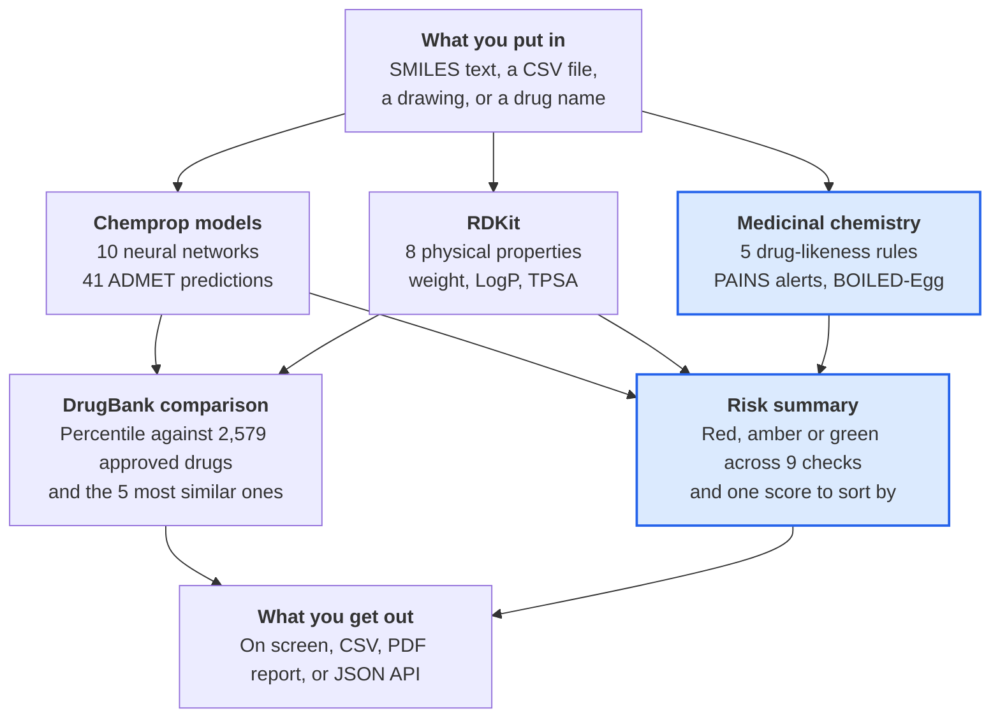

# ChemXplore Demo Guide

Written for someone presenting ChemXplore who did not build it.

ChemXplore predicts how a drug-like molecule will behave in the body and flags the ones worth dropping early. This guide explains what it does, what was added on top of the original ADMET-AI project, and exactly how to run the demo.

## Contents

- [What it does](#what-it-does)
- [How it works](#how-it-works)
- [What already existed](#what-already-existed)
- [What was added, and why it matters](#what-was-added-and-why-it-matters)
- [What was broken, and what fixed it](#what-was-broken-and-what-fixed-it)
- [Running it](#running-it)
- [The demo script](#the-demo-script)
- [Questions you may be asked](#questions-you-may-be-asked)
- [Limits to state honestly](#limits-to-state-honestly)

## What it does

Most drug candidates fail not because they miss their target, but because of what the body does to them: they are not absorbed, they are destroyed too fast, or they are toxic.

Those properties are called **ADMET** — absorption, distribution, metabolism, excretion and toxicity. Measuring them in a lab costs money and takes weeks. ChemXplore predicts them from the molecule's structure alone, in seconds.

The point is triage. A screening run can produce thousands of candidate molecules, and ChemXplore tells you which ones are worth testing and which to drop early.

**What you put in:** a SMILES string, which is a way of writing a molecule's structure as text. `CC(C)Cc1ccc(cc1)C(C)C(=O)O` is ibuprofen.

**What you get back:** 49 predicted properties, a comparison against 2,579 approved drugs, drug-likeness checks, warnings about problem chemical groups, and a red/amber/green risk summary per molecule.

## How it works

A molecule goes in once and comes out the far end with a verdict. The two highlighted boxes are the new work; everything else came from ADMET-AI.



Highlighted in blue: added in ChemXplore. The rest came from ADMET-AI.

## What already existed

ChemXplore is built on [ADMET-AI](https://github.com/swansonk14/admet_ai), an open-source project from the Zou lab at Stanford, published in *Bioinformatics* in 2024. Credit for the prediction engine belongs there.

ADMET-AI supplied the parts that are hardest to reproduce:

- **The trained models.** A graph neural network called Chemprop-RDKit, trained on 41 ADMET datasets from the Therapeutics Data Commons. These are the `.pt` files in the repo.
- **The DrugBank reference set.** 2,579 approved drugs with predictions already computed, so any new molecule can be ranked as a percentile against real drugs.
- **8 physicochemical properties** computed with RDKit, such as molecular weight and LogP.
- **Three ways to run it:** a command line tool, a Python module and a Flask web server.
- **Two plots:** the DrugBank scatter plot and the radial summary per molecule.

The repository already carried one commit of its own that rebranded the site to ChemXplore and redesigned the page. That work changed how the site looked, but the new page called server routes that did not exist, so several features on it did not work. The prediction engine underneath was untouched and working.

**Say this if asked what is yours:** the prediction models are ADMET-AI's. The medicinal chemistry layer, the risk triage, the comparison view, the API, the report and the repairs to the web app are new.

## What was added, and why it matters

The original gives you 49 numbers per molecule. The additions answer the question a chemist actually asks: *should I make this one?*

| Added | What it does | Why it matters |
| --- | --- | --- |
| Drug-likeness rules | Checks 5 published rules (Lipinski, Ghose, Veber, Egan, Muegge) and names the exact criterion broken | Says whether a molecule can work as an oral drug. Naming the criterion tells a chemist what to change |
| Structural alerts | Flags PAINS and Brenk substructures, highlighting the offending atoms on the structure | PAINS compounds give false positives in lab assays. Catching them early avoids weeks of chasing a dud |
| Synthetic accessibility | Scores 1 (easy) to 10 (hard) to make | A molecule nobody can synthesise is not a candidate, however good its predictions look |
| BOILED-Egg | Predicts gut absorption and brain penetration from 2 properties, plus a plot | Answers two of the most common questions at a glance. Brain access is essential for CNS drugs and unwanted for most others |
| Nearest approved drugs | The 5 most similar DrugBank drugs by molecular fingerprint | Instant context. Resembling an approved drug is reassuring, and it catches when you have rediscovered something known |
| Risk summary | Red/amber/green across 9 checks, plus a single score | Turns 49 raw numbers into a verdict you can sort a list by |
| Overview table | One row per molecule, sortable and filterable | Screening is about comparing molecules, not reading them one at a time |
| Comparison view | 2 to 4 molecules side by side on every property | This is how you pick between shortlisted candidates |
| Compound names | Type `aspirin` and it is resolved through PubChem | You no longer need a SMILES string to hand. Useful in demos and for non-chemists |
| JSON API | `POST /api/predict` returns everything as JSON | Makes it a service other tools and notebooks can call, not just a website |
| Report and PDF | A printable report, exported as PDF | Results you can send to a supervisor or attach to a write-up |
| Tests and CI | 56 tests run on every push to GitHub | Shows the work is correct and stops later changes breaking it |

## What was broken, and what fixed it

Several things in the existing code did not work. If anyone asks what the engineering effort went into, this is a good part of the answer.

| Problem | Effect on the user | Fix |
| --- | --- | --- |
| The SMILES box stayed a required field when hidden | File upload and Draw mode could not submit at all. The browser silently blocked the form | Only the visible input is required, set as the mode changes |
| The page called `/get_drugbank_size` and `/update_drugbank_plot`, which were never built | Changing the plot axes did nothing | Rewrote the page script against the routes that exist |
| Models fail to load on PyTorch 2.6 and newer | The app would not start at all on a fresh install | Pinned `torch<2.6` and documented why |
| `admet_web --port 5000` was rejected | You could not choose the port, despite the option existing | Host and port now parsed properly |
| Stored results were only freed for users who had sent a heartbeat | Anyone who left within 60 seconds leaked their results in memory forever | Activity is recorded when results are saved, not only on heartbeat |
| PDF export needed a program that was never installed or declared | The button returned an error page | Falls back to the browser's print dialog, and the Docker image now ships the program |
| Plot and model state shared across requests without locking | Two users at once could corrupt each other's plots | Serialised access to both |
| Values from the browser went unchecked | A malformed request could raise a server error | Validated, returning a clear message instead |
| A new session key on every restart | Everyone was logged out whenever the server restarted | Read from `CHEMXPLORE_SECRET_KEY` |
| Duplicate folders, ~50 unused demo files, a 1.2 MB logo | A slow, confusing repository | Removed; the repo is about 6 MB lighter and the logo is 31 KB |

## Running it

**If the project is already set up** (it is on Keerti's machine, in `~/Desktop/ChemXplore`), one command starts it:

```bash
cd ~/Desktop/ChemXplore
.venv/bin/admet_web --port 5000
```

Wait for the terminal to print `Running on http://127.0.0.1:5000`, then open that address in a browser. **Starting takes about 30 seconds** while the models load, and the terminal looks frozen during it. That is normal.

**Start it before the audience is watching.** Leave it running in a terminal window you do not close.

**On a fresh machine**, set it up once. This downloads roughly 1 GB and takes several minutes, so do not do it on the day:

```bash
git clone https://github.com/12keerti21/ChemXplore.git
cd ChemXplore
python3.11 -m venv .venv
.venv/bin/pip install "torch==2.5.1" --index-url https://download.pytorch.org/whl/cpu
.venv/bin/pip install -e ".[web]"
```

### If something goes wrong

| Symptom | What to do |
| --- | --- |
| `Address already in use` | It is already running, or something else holds the port. Use `--port 5001` and open that instead |
| The page takes 30+ seconds and seems stuck | The models are loading. Only happens on the first start |
| Predictions seem slow | Normal. 5 molecules take a few seconds, since it runs 10 neural networks |
| A page says results have expired | Results are dropped after 5 minutes idle. Run the prediction again |
| `command not found` | You are in the wrong folder, or the setup above was never run |

**Fallback if the laptop fails:** the [README](../README.md) has screenshots of every screen. You can present from those.

## The demo script

About 6 minutes. Use these 5 molecules rather than the Example button — the third one is what makes the demo land, and the Example button does not include it.

```
CC(C)Cc1ccc(cc1)C(C)C(=O)O
CN1C=NC2=C1C(=O)N(C)C(=O)N2C
O=C1C=CC(=O)C=C1
CC(=O)Oc1ccccc1C(=O)O
CN1CCC[C@H]1c1cccnc1
```

They are ibuprofen, caffeine, benzoquinone, aspirin and nicotine. Four are familiar; benzoquinone is the troublemaker.

1. **Open the page.** Say: *"This predicts how a molecule behaves in the body — whether it is absorbed, whether it is toxic — without doing any lab work."*
2. **Paste the 5 lines into the SMILES box and press Generate Predictions.** While it runs (a few seconds), say: *"Each line is a molecule written as text. It is running 10 neural networks over each one, predicting 41 properties."*
3. **Stop at the Overview table.** This is the centrepiece. Say: *"One row per molecule. The coloured badges are a risk summary, and the last column shows the approved drug each one most resembles."* Point out that row 1 matches **Dexibuprofen at 1.00** — it recognised ibuprofen. Then **click the Risk column header** to sort, and say: *"With a thousand molecules, this is how you find the few worth making."*
4. **Point at row 3, benzoquinone.** It has **2 alerts** and a red badge where the others are green. Say: *"This one is flagged. Let us see why."*
5. **Click row 3 to expand it.** Walk down: the risk table, then the drug-likeness rules showing **Ghose and Muegge failing with the reason named**. Then reach **Structural alerts** — two structures with the ring highlighted in red. Say: *"These are PAINS alerts. They are compounds that react with everything and give false positives in lab assays. People have wasted months chasing these. It shows exactly which atoms are the problem."* **This is the moment of the demo — pause here.**
6. **Scroll to Most similar approved drugs** in the same panel, then collapse it.
7. **Tick molecules 1, 2 and 3 and press Compare.** A new tab opens with them side by side. Say: *"When you have narrowed it down, you compare candidates property by property."* Point to the Risk score row: **1, 2 and 3** — lower is better.
8. **Back on the main tab, open the BOILED-Egg Plot.** Say: *"The white region means it should be absorbed from the gut. The yolk means it should reach the brain. Ibuprofen and nicotine are in the yolk; nicotine reaching the brain is exactly why it is addictive."*
9. **Close with the Report button and the API.** Say: *"Results export as a PDF report, and there is a JSON API so other tools can call it."*

**If you only have 2 minutes:** steps 2, 3 and 5. The overview table and the highlighted alerts carry the whole story.

## Questions you may be asked

| Question | Answer |
| --- | --- |
| Did you train these models? | No, and say so plainly. The models come from ADMET-AI, an open-source Stanford project. The medicinal chemistry analysis, risk triage, comparison, API and report built on top are the new work |
| How accurate is it? | It varies by property, and the app shows each one's score. Intestinal absorption is strong at 0.98 AUROC; some, like half-life, are poor. Properties with weak models are labelled **Lower accuracy** in the interface |
| Where does the data come from? | 41 datasets from the Therapeutics Data Commons for the models, and 2,579 approved drugs from DrugBank as the comparison set |
| Could this replace lab testing? | No. It prioritises which molecules are worth testing. Everything still needs confirming experimentally |
| What is a SMILES string? | A way of writing a molecule's structure as a line of text, so software can read it |
| What is PAINS? | Pan-assay interference compounds: molecules that react with many targets and look like hits when they are not. Screening them out is standard practice |
| Caffeine obviously reaches the brain, so why does it say no? | A fair catch, and a good answer to have ready. BOILED-Egg is a simple rule drawn from two properties, and caffeine sits just outside its boundary. It shows why the tool flags candidates for review rather than deciding anything |
| How many molecules can it handle? | Up to 1,000 per run, with the first 25 shown on screen and all of them in the CSV |
| Who chose the risk thresholds? | They were set for this project as screening heuristics, not taken from a regulatory standard. They rank molecules against each other; they are not clinical cut-offs |
| Is it tested? | 56 automated tests run against the real models on every push, covering the chemistry, the risk rules and every web route |

## Limits to state honestly

Saying these before someone else points them out makes the demo stronger, not weaker.

- **The models are not ours.** ADMET-AI built and trained them. The contribution here is the analysis layer on top and the repairs underneath.
- **It is a screening tool.** It ranks molecules for further work. It is not a safety assessment and carries no clinical validation.
- **Accuracy differs sharply by property.** Absorption predicts well; half-life and volume of distribution predict poorly. The interface marks the weak ones rather than hiding them.
- **The risk thresholds are judgement calls** made for this project, useful for comparing molecules against each other and not for deciding anything on their own.
- **The BOILED-Egg boundaries still need checking** against [SwissADME](https://www.swissadme.ch) for a handful of molecules. They are taken from the 2016 paper and give sensible results, but that check has not been done.

If you are asked something you do not know, say you will check rather than guessing. For anything in the code itself, the [repository](https://github.com/12keerti21/ChemXplore) and its README are the reference.
